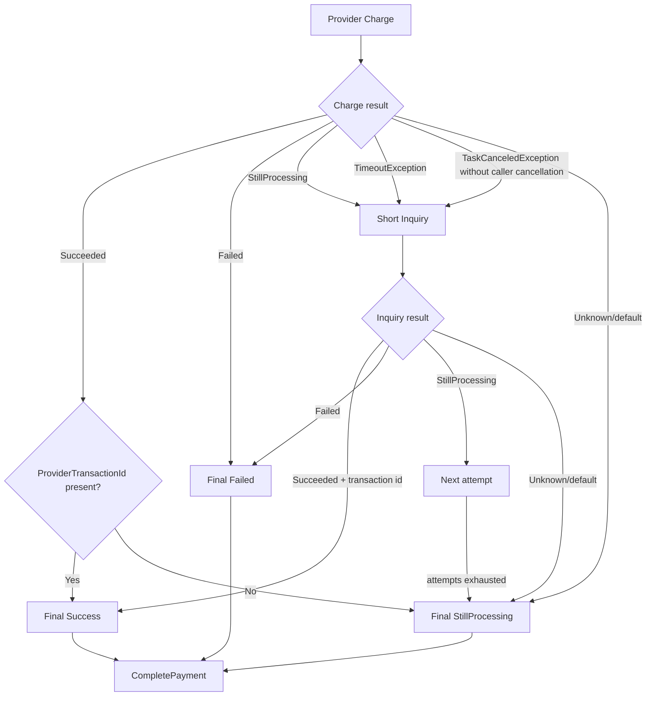

# PayBridge Provider Inquiry Flow

**Document status:** IMPLEMENTED + CURRENT FLOW + KNOWN RISKS + TARGET RECOVERY  
**Target path:** `docs/flows/PROVIDER_INQUIRY_FLOW.md`  
**Repository:** `ucartalha/PayBridge`  
**Reviewed branch:** `main`  
**Reviewed commit:** `bb696739e98a46de0af6829b24c9948491d9d329`  
**Reviewed commit message:** `refund started and logging improvements`  
**Review date:** `2026-09-17`

> This document describes how PayBridge currently interprets provider Charge results, converts uncertain outcomes into Inquiry, performs short synchronous Inquiry attempts, persists `Processing`, and protects against blind second Charge execution.
>
> It also documents current gaps that must be solved before production-grade provider recovery/reconciliation.

---

# 1. Purpose

Payment-provider communication is inherently uncertain.

A provider request may:

- succeed normally
- fail explicitly
- remain processing
- timeout before PayBridge receives a response
- reach the provider but lose the response
- return an invalid/incomplete success response
- require a separate status Inquiry
- suffer a transport-level failure whose delivery status is unknown

The most important PayBridge rule is:

```text
UNKNOWN CHARGE OUTCOME
DOES NOT MEAN
CHARGE AGAIN
```

Instead:

```text
Charge
    ↓
Outcome uncertain
    ↓
Inquiry
    ↓
Succeeded / Failed / StillProcessing
```

If certainty still cannot be reached:

```text
Payment = Processing
```

and future reconciliation must resolve the operation.

---

# 2. Current Capability Status

| Capability | Status |
|---|---|
| Provider abstraction | IMPLEMENTED |
| Provider factory | IMPLEMENTED |
| ProviderCode-based selection | IMPLEMENTED |
| Provider logging decorator | IMPLEMENTED |
| Provider Charge | IMPLEMENTED |
| Provider Inquiry | IMPLEMENTED |
| Timeout → Inquiry conversion | IMPLEMENTED |
| Short synchronous Inquiry | IMPLEMENTED |
| Success requires ProviderTransactionId | IMPLEMENTED |
| Unresolved outcome → Processing | IMPLEMENTED |
| Provider credential resolution for Charge | IMPLEMENTED |
| Provider credential propagation to Inquiry | IMPLEMENTED |
| Persistent reconciliation worker | TARGET |
| Queue-backed recovery | TARGET |
| Exponential backoff | TARGET |
| Reconciliation SLA | TARGET |
| Manual reconciliation workflow | TARGET |
| Provider-specific error classification | PARTIAL |
| Transport exception classification | PARTIAL |
| Provider health scoring | TARGET |
| Automatic fallback | TARGET |
| Real production PSP adapter | TARGET |
| Provider access-token cache | TARGET |

---

# 3. Primary Code Locations

Current provider-recovery path:

```text
src/Modules/Payments/
└── PayBridge.Modules.Payments.Application/
    └── Payments/PaymentsExecution/
        ├── PaymentOrchestrator.cs
        ├── ProviderPaymentResultResolver.cs
        └── ProviderFinalResult.cs

src/Modules/Payments/
└── PayBridge.Modules.Payments.Infrastructure/
    └── PaymentsExecution/
        └── ProviderCredentialResolver.cs

src/Modules/Providers/
├── PayBridge.Modules.Providers.Contracts/
│   ├── IPaymentProvider.cs
│   ├── IPaymentProviderFactory.cs
│   ├── ProviderChargeRequest.cs
│   ├── ProviderChargeResponse.cs
│   ├── ProviderInquiryRequest.cs
│   ├── ProviderInquiryResponse.cs
│   ├── ProviderCredentialContext.cs
│   └── Enums/
│       └── ProviderPaymentState.cs
│
└── PayBridge.Modules.Providers.Infrastructure/
    ├── DependencyInjection.cs
    ├── PaymentProviderFactory.cs
    ├── Decorators/
    │   └── LoggingPaymentProviderDecorator.cs
    └── Mock/
        └── MockPaymentProvider.cs
```

Payment finalization intersects with:

```text
src/Modules/Payments/
└── PayBridge.Modules.Payments.Application/
    └── Payments/CompletePayment/
        └── CompletePaymentCommandHandler.cs
```

---

# 4. Current Provider Abstraction

Provider contract:

```text
IPaymentProvider
```

Current operations:

```text
ProviderCode

ChargeAsync(
    ProviderChargeRequest,
    CancellationToken
)

InquiryAsync(
    ProviderInquiryRequest,
    CancellationToken
)
```

The Payments module does not directly call provider-specific SDK types.

This contract is the provider boundary.

---

# 5. Provider Selection

Current selection is explicit.

Payment request supplies:

```text
ProviderCode
```

Then:

```text
PaymentProviderFactory.Resolve(providerCode)
```

selects an `IPaymentProvider`.

Matching is:

```text
OrdinalIgnoreCase
```

If no provider exists:

```text
ProviderNotSupported
```

business error is raised.

Current status:

```text
explicit provider selection: IMPLEMENTED
smart routing: TARGET
```

---

# 6. Current Registered Provider

Current provider infrastructure registers:

```text
MockPaymentProvider
```

and exposes it through:

```text
LoggingPaymentProviderDecorator
```

to the `IPaymentProvider` collection.

Conceptually:

```text
PaymentProviderFactory
    ↓
IPaymentProvider
    ↓
LoggingPaymentProviderDecorator
    ↓
MockPaymentProvider
```

Real PSP adapters are not yet present in the reviewed branch.

---

# 7. Provider Logging Decorator

Both operations are decorated:

```text
ChargeAsync
InquiryAsync
```

Current structured fields include:

```text
ProviderCode
PaymentId
ProviderState
DurationMs
ErrorCode
```

The decorator does NOT intentionally log:

```text
credential payload
provider access token
card data
```

Preserve that rule.

---

# 8. Payment Orchestrator Position

Current Sale flow:

```text
CreatePaymentCommand
    ↓
TX #1 COMMIT
    ↓
ProviderChargeRequest
    ↓
ProviderPaymentResultResolver.ResolveAsync(...)
    ↓
Charge / optional Inquiry
    ↓
ProviderFinalResult
    ↓
CompletePaymentCommand
    ↓
TX #2 COMMIT
```

The provider execution window is outside the Payment DB transaction.

This is intentional.

---

# 9. ProviderChargeRequest

Current request fields:

```text
PaymentId
OrderId
Amount
Currency
IdempotencyKey
Credential
```

Current provider idempotency key:

```text
PaymentId.ToString("N")
```

This is distinct from the PayBridge API request idempotency key.

---

# 10. Provider Credentials

Before Charge, PayBridge resolves:

```text
ProviderCredentialContext
```

using:

```text
MerchantId
ProviderCode
Channel
```

The credential resolver:

```text
active MerchantProviderAccount
    ↓
active credential
    ↓
decrypt / unprotect
    ↓
ProviderCredentialContext
```

The resulting credential is attached to:

```text
ProviderChargeRequest.Credential
```

---

# 11. ProviderPaymentState

Current enum:

```text
Unknown = 0
Succeeded = 1
Failed = 2
StillProcessing = 3
Cancelled = 4
Rejected = 5
```

However, the current result resolver does not explicitly handle every enum member.

This is documented later as a known risk.

---

# 12. ProviderChargeResponse

Current normalized Charge response:

```text
State
ProviderTransactionId
ErrorCode
ErrorMessage
```

Factory helpers:

```text
Success(...)
Failed(...)
InquiryRequired(...)
```

`InquiryRequired(...)` maps to:

```text
State = StillProcessing
```

---

# 13. High-Level Charge Resolution



---

# 14. ChargeSafelyAsync

Current resolver wraps provider Charge in:

```text
ChargeSafelyAsync
```

Normal call:

```text
provider.ChargeAsync(
    chargeRequest,
    cancellationToken
)
```

Two exception families are currently normalized into Inquiry-required state.

---

# 15. Charge TimeoutException

Current handling:

```text
catch TimeoutException
```

becomes:

```text
ProviderChargeResponse.InquiryRequired(
    PROVIDER_TIMEOUT,
    exception.Message
)
```

Therefore:

```text
timeout
    ↓
StillProcessing
    ↓
Inquiry
```

Not:

```text
timeout
    ↓
Charge again
```

---

# 16. Charge TaskCanceledException

Current handling:

```text
catch TaskCanceledException
when !cancellationToken.IsCancellationRequested
```

This distinction means:

```text
TaskCanceledException
+
caller token NOT cancelled
```

is interpreted as provider/network timeout.

It becomes:

```text
PROVIDER_TIMEOUT
    ↓
Inquiry
```

---

# 17. Caller Cancellation Is Different

If:

```text
cancellationToken.IsCancellationRequested == true
```

the resolver does NOT normalize that `TaskCanceledException` into provider timeout.

The exception escapes.

This preserves the difference between:

```text
provider timeout
```

and:

```text
caller/request cancellation
```

They are not semantically identical.

---

# 18. Why Caller Cancellation Is Dangerous

Cancellation can occur:

```text
before provider send
during network send
after provider received request
while response is returning
```

Therefore:

```text
caller disconnected
```

does NOT prove:

```text
provider never processed Charge
```

Current outer idempotency behavior preserves SQL `InFlight` on unexpected technical/cancellation failure, which prevents an immediate duplicate workflow from freely re-executing.

However persistent automatic recovery is still missing.

---

# 19. CRITICAL KNOWN GAP — Transport Exception Classification

Current `ChargeSafelyAsync` explicitly normalizes:

```text
TimeoutException
TaskCanceledException when caller token not cancelled
```

It does NOT normalize every possible uncertain transport exception.

Potential examples:

```text
HttpRequestException
connection reset
socket failure
TLS interruption
DNS/network stack error
provider SDK transport exception
```

Some of these can happen AFTER a request may have reached the provider.

If they escape as technical exceptions:

```text
SQL idempotency remains InFlight
```

which protects against blind duplicate execution, but the payment may remain unresolved.

A production provider adapter/recovery layer needs explicit exception classification.

---

# 20. Exception Classification Principle

Future provider integration should classify errors into at least:

```text
SAFE_PRE_SEND_FAILURE
    provider definitely did not receive financial request

KNOWN_PROVIDER_FAILURE
    provider explicitly rejected/failed operation

UNCERTAIN_POST_SEND_FAILURE
    provider may have processed operation

CALLER_CANCELLATION
    request lifecycle ended; delivery certainty depends on stage
```

Only:

```text
KNOWN_PROVIDER_FAILURE
```

can safely become final Failed without further Inquiry.

`UNCERTAIN_POST_SEND_FAILURE` requires reconciliation.

---

# 21. Charge State Mapping

Current resolver behavior:

```text
Succeeded
    → Success if transaction id exists
    → otherwise StillProcessing

Failed
    → Final Failed

StillProcessing
    → Short Inquiry

everything else
    → Final StillProcessing
```

---

# 22. Success Requires ProviderTransactionId

A provider cannot finalize success with:

```text
State = Succeeded
ProviderTransactionId = null/empty
```

Current resolver returns:

```text
StillProcessing
```

with:

```text
PROVIDER_TRANSACTION_ID_MISSING
```

This is a strong safety choice.

Provider success without a stable provider reference is not considered sufficiently final.

---

# 23. Why ProviderTransactionId Matters

A provider transaction identifier is important for:

- Inquiry
- support investigation
- refund/void
- reconciliation
- dispute handling
- webhook correlation
- auditability

PayBridge therefore requires it before final success.

---

# 24. Charge Failed

Provider response:

```text
State = Failed
```

becomes:

```text
ProviderFinalResult.Failed
```

with fallback values if provider omitted error data:

```text
PROVIDER_PAYMENT_FAILED
Provider payment failed.
```

No Inquiry is currently performed after explicit `Failed`.

That assumes a provider adapter only returns `Failed` when the result is known terminal.

---

# 25. Provider Adapter Contract Rule

A real adapter must NOT map an uncertain response into:

```text
Failed
```

simply because an HTTP call did not complete normally.

Adapter normalization must preserve uncertainty.

Use:

```text
StillProcessing
```

or an exception classification that leads to Inquiry.

---

# 26. Current Short Inquiry Schedule

When Charge is `StillProcessing`, PayBridge performs up to three Inquiry calls.

Current delay array:

```text
0 ms
500 ms
1000 ms
```

This means:

```text
Attempt #1 immediately

wait 500 ms
Attempt #2

wait 1000 ms
Attempt #3
```

Total configured waiting between attempts:

```text
1500 ms
```

plus provider request latency.

---

# 27. Inquiry Request

Current Inquiry request contains:

```text
PaymentId
OrderId
Amount
Currency
ProviderTransactionId
AttemptNumber
Credential = optional
```

The attempt number starts at:

```text
1
```

and increments for each short Inquiry.

---

# 28. ProviderTransactionId in Inquiry

The resolver passes:

```text
chargeResponse.ProviderTransactionId
```

into Inquiry.

This is useful when a provider returns:

```text
StillProcessing
+
provider transaction reference
```

If Charge timeout produced no reference:

```text
ProviderTransactionId = null
```

Inquiry must rely on other correlation fields such as:

```text
PaymentId
OrderId
```

depending on provider capabilities.

---

# 29. Inquiry Credential Propagation

`ProviderInquiryRequest` supports:

```text
ProviderCredentialContext? Credential
```

Current `ProviderPaymentResultResolver` constructs short Inquiry requests with the same runtime credential context used for Charge:

```text
ProviderInquiryRequest(
    ...,
    Credential: chargeRequest.Credential
)
```

This means a resolved:

```text
ProviderCredentialContext
```

is passed to both:

```text
ChargeAsync
InquiryAsync
```

The credential context remains a sensitive runtime object. It must not be logged, serialized to API responses, copied into payment aggregates, or included in provider error messages.

---

# 30. InquirySafelyAsync

Each Inquiry is wrapped in:

```text
InquirySafelyAsync
```

Normal call:

```text
provider.InquiryAsync(
    request,
    cancellationToken
)
```

Timeout normalization is similar to Charge.

---

# 31. Inquiry TimeoutException

Current:

```text
TimeoutException
```

becomes:

```text
ProviderInquiryResponse.StillProcessing(
    PROVIDER_INQUIRY_TIMEOUT,
    exception.Message
)
```

Then short Inquiry loop continues if attempts remain.

---

# 32. Inquiry TaskCanceledException

Current:

```text
TaskCanceledException
when !cancellationToken.IsCancellationRequested
```

also becomes:

```text
StillProcessing
```

Caller/request cancellation still propagates.

---

# 33. Inquiry State Mapping

Current:

```text
Succeeded
    → Success if ProviderTransactionId exists
    → otherwise StillProcessing

Failed
    → Final Failed

StillProcessing
    → continue attempts

default/unknown state
    → immediately Final StillProcessing
```

A default/unknown Inquiry state does NOT continue the remaining short attempts.

---

# 34. Inquiry Success Missing Transaction ID

If Inquiry returns:

```text
Succeeded
```

without:

```text
ProviderTransactionId
```

PayBridge returns:

```text
StillProcessing
```

with:

```text
PROVIDER_INQUIRY_TRANSACTION_ID_MISSING
```

This matches the Charge success rule.

---

# 35. Inquiry Explicit Failure

If provider Inquiry returns:

```text
Failed
```

PayBridge finalizes:

```text
ProviderFinalResult.Failed
```

with provider error or fallback:

```text
PROVIDER_INQUIRY_FAILED
```

Again this assumes adapter `Failed` means known terminal failure.

---

# 36. Inquiry Exhaustion

After all three Inquiry attempts remain:

```text
StillProcessing
```

PayBridge returns:

```text
ProviderFinalResult.StillProcessing
```

Error information comes from the last Inquiry response when present.

Fallback:

```text
PROVIDER_INQUIRY_UNRESOLVED
Provider inquiry could not resolve payment status.
```

---

# 37. ProviderFinalResult

Current final normalized states used by the Sale flow are effectively:

```text
Succeeded
Failed
StillProcessing
```

Fields:

```text
State
ProviderTransactionId
ErrorCode
ErrorMessage
```

This object is the boundary between:

```text
provider communication/recovery
```

and:

```text
Payment state persistence
```

---

# 38. CompletePayment Mapping

Current `CompletePaymentCommandHandler` maps:

```text
Succeeded
    → Payment Succeeded
    → Sale Transaction Succeeded

Failed
    → Payment Failed
    → Sale Transaction Failed

StillProcessing
    → Payment Processing
    → Sale Transaction Pending
```

Default/unknown provider state also becomes:

```text
Processing
```

---

# 39. Processing Is a Deliberate Financial State

`Processing` means:

```text
PayBridge does not currently have enough evidence
to safely declare success or failure.
```

It does NOT mean:

```text
provider definitely failed.
```

It is a recoverability state.

---

# 40. CRITICAL RULE — No Blind Second Charge

Never implement:

```text
Charge
    ↓
timeout
    ↓
Charge
```

or:

```text
Charge
    ↓
StillProcessing
    ↓
switch provider
    ↓
Charge again
```

without proof that the first provider did not and cannot complete the financial operation.

---

# 41. Provider Idempotency Does Not Make Blind Retry Safe

Charge request currently carries:

```text
IdempotencyKey = PaymentId
```

A real provider may support provider-level idempotency.

That is defense-in-depth.

It does NOT change the PayBridge rule:

```text
uncertain result
    → Inquiry
```

Provider idempotency guarantees vary between PSPs, endpoints, time windows, and failure modes.

---

# 42. Automatic Fallback Is Not Yet Implemented

Current flow uses one provider selected by:

```text
ProviderCode
```

There is no current:

```text
Provider A
    ↓
failed/timeout
    ↓
Provider B Charge
```

logic.

This is important.

Automatic fallback must not be added until failure classes are defined.

---

# 43. Future Safe Fallback Categories

Potential future routing/fallback logic should distinguish:

```text
PRE-SEND SAFE FAILURE
    example: provider disabled locally before request
    → another provider may be safe

EXPLICIT TERMINAL REJECTION
    policy decision required
    → another provider may sometimes be safe

UNCERTAIN POST-SEND
    → NEVER switch to another provider Charge immediately
    → reconcile first
```

This must be encoded in an ADR before implementation.

---

# 44. KNOWN RISK — Cancelled and Rejected Enum States

Current enum includes:

```text
Cancelled
Rejected
```

but `ProviderPaymentResultResolver` only explicitly handles:

```text
Succeeded
Failed
StillProcessing
```

Therefore Charge response:

```text
Cancelled
or
Rejected
```

currently falls into the default branch and becomes:

```text
StillProcessing
PROVIDER_UNKNOWN_STATE
```

The same conceptual issue exists for Inquiry default states.

---

# 45. Cancelled / Rejected Mapping Must Be Defined

Before real provider adapters use these states, PayBridge must decide their canonical meaning.

Possible business interpretations vary:

```text
Rejected
    may represent terminal Failed

Cancelled
    may represent terminal Failed
    or a distinct provider terminal state
```

Do NOT guess provider semantics globally.

Define mapping at either:

- adapter normalization layer
- central resolver policy

and test it.

Until then, providers should preferably normalize known terminal rejection into the currently supported canonical state:

```text
Failed
```

if that is semantically correct.

---

# 46. KNOWN RISK — Unknown Inquiry Stops Short Retry Loop

Current Inquiry switch:

```text
Unknown/default
    → return StillProcessing immediately
```

It does not continue later short Inquiry attempts.

That may be correct if unknown enum means malformed/unsupported provider state.

But if a provider uses `Unknown` transiently, additional attempts could have resolved it.

Provider-state contract semantics should be clarified before production adapters.

---

# 47. Mock Provider Scenarios

Current Mock provider intentionally supports recovery testing through Amount.

These values are not production behavior.

They are development scenarios.

---

# 48. Mock Amount = 13

Charge:

```text
Failed
MOCK_PAYMENT_FAILED
```

Expected flow:

```text
Charge
    ↓
Final Failed
    ↓
no Inquiry
```

---

# 49. Mock Amount = 99

Charge:

```text
StillProcessing
MOCK_PROVIDER_REQUIRES_INQUIRY
```

Inquiry:

```text
Attempt 1
→ StillProcessing

Attempt 2
→ Success
```

Expected final Payment:

```text
Succeeded
```

---

# 50. Mock Amount = 98

Charge:

```text
StillProcessing
MOCK_PROVIDER_TIMEOUT
```

Inquiry:

```text
Attempt 1
→ StillProcessing

Attempt 2
→ StillProcessing

Attempt 3
→ Failed
```

Expected final Payment:

```text
Failed
```

---

# 51. Mock Amount = 97

Charge:

```text
StillProcessing
MOCK_PROVIDER_ALWAYS_UNKNOWN
```

All Inquiry attempts:

```text
StillProcessing
```

Expected final Payment:

```text
Processing
```

Sale Transaction remains:

```text
Pending
```

This is the current unresolved-state test scenario.

---

# 52. Default Mock Amount

Normal Charge returns:

```text
Succeeded
ProviderTransactionId = MOCK-...
```

No Inquiry occurs.

Expected final Payment:

```text
Succeeded
```

---

# 53. Mock Provider Is Not a Real Timeout Test

Amounts 98/99/97 return:

```text
ProviderChargeResponse.InquiryRequired(...)
```

directly.

They do NOT necessarily throw a real:

```text
TimeoutException
TaskCanceledException
HttpRequestException
```

Therefore these scenarios test resolver state behavior, but not all network exception behavior.

Dedicated tests must simulate actual exceptions.

---

# 54. Logging Decorator and Charge

On normal Charge response, decorator logs:

```text
Provider Charge completed
ProviderCode
PaymentId
ProviderState
DurationMs
ErrorCode
```

Then returns response unchanged.

It does not change state semantics.

---

# 55. Logging Decorator and Inquiry

On normal Inquiry response, decorator logs equivalent structured fields:

```text
Provider inquiry completed
ProviderCode
PaymentId
ProviderState
DurationMs
ErrorCode
```

This provides operational visibility into recovery attempts.

---

# 56. Caller Cancellation Logging

Decorator handles:

```text
OperationCanceledException
when cancellationToken.IsCancellationRequested
```

as an informational:

```text
Provider charge cancelled by request
```

or:

```text
Provider inquiry cancelled by request
```

then rethrows.

This is intentionally distinct from unexpected provider exception logging.

---

# 57. KNOWN OBSERVABILITY GAP — Provider Timeout May Log as Unexpected Error

Consider an HttpClient-like timeout represented by:

```text
TaskCanceledException
```

while caller token itself is NOT cancelled.

In the logging decorator:

```text
OperationCanceledException when caller token cancelled
```

does not match.

So generic:

```text
catch Exception
```

can log:

```text
Provider charge failed unexpectedly
```

and rethrow.

Then `ProviderPaymentResultResolver` catches the same `TaskCanceledException` and converts it to:

```text
PROVIDER_TIMEOUT
→ Inquiry
```

Therefore logs may classify a recoverable provider timeout as an unexpected error even though application logic treats it as an expected recovery condition.

This is a logging semantics issue, not a financial correctness issue.

---

# 58. Recommended Timeout Logging Direction

Future observability should distinguish:

```text
caller cancellation
provider timeout / transport timeout
provider explicit failure
unexpected programming/system error
```

This allows metrics such as:

```text
provider_timeout_rate
provider_inquiry_rate
provider_unresolved_rate
provider_terminal_failure_rate
```

without counting all timeout recovery as application errors.

---

# 59. Current Inquiry Correlation Inputs

Inquiry request currently has multiple potential correlation keys:

```text
PaymentId
OrderId
Amount
Currency
ProviderTransactionId
AttemptNumber
```

Real providers differ in what they support.

Adapter responsibility is to map PayBridge's canonical request into the provider's supported inquiry mechanism.

---

# 60. Provider Transaction ID After Timeout

If timeout occurs before PayBridge receives a response:

```text
ProviderTransactionId = null
```

A production provider must still offer some safe way to inquire using a merchant-generated reference, order id, idempotency key, or equivalent.

Before onboarding a PSP, verify this capability.

If a PSP cannot inquire an uncertain Charge without its own transaction ID, recovery architecture must be designed very carefully.

---

# 61. Provider Integration Readiness Requirement

A provider should not be considered fully PayBridge-compatible until the integration defines:

```text
Charge correlation key
Inquiry correlation key
timeout behavior
transport exception behavior
terminal success mapping
terminal failure mapping
processing mapping
provider idempotency semantics
credential/auth lifecycle
refund/void semantics
webhook semantics
```

Charge alone is insufficient.

---

# 62. Inquiry Must Be Read/Status-Oriented

Inquiry should NOT create a new payment.

Provider adapter Inquiry must map to a status-query operation.

Never implement Inquiry by internally calling Charge again.

---

# 63. Current Synchronous Recovery Budget

Current short recovery is intentionally small:

```text
0 ms
500 ms
1000 ms
```

This keeps HTTP request duration bounded relative to long reconciliation.

It is a first recovery layer, not the final recovery system.

---

# 64. Short Inquiry vs Reconciliation

Current:

```text
Short Inquiry
= same request lifecycle
= max three attempts
= quick recovery
```

Future:

```text
Reconciliation
= after request lifecycle
= durable scheduling
= longer backoff
= repeated Inquiry
= operational visibility
```

These are different mechanisms.

---

# 65. Persistent Reconciliation Is Missing

Today, after:

```text
Payment = Processing
```

there is no complete implemented worker shown in the reviewed repository that guarantees:

```text
schedule next Inquiry
retry later
eventually resolve
escalate manually
```

Therefore:

```text
Processing
```

is durable but not yet fully self-healing.

Status:

```text
durable uncertainty state: IMPLEMENTED
automated long recovery: TARGET
```

---

# 66. Target Reconciliation Flow

Recommended conceptual target:

```text
Payment = Processing
    ↓
Durable reconciliation task
    ↓
Worker acquires payment recovery ownership
    ↓
Provider Inquiry
    ↓

Succeeded
    → short TX
    → Payment Succeeded
    → Transaction Succeeded

Failed
    → short TX
    → Payment Failed
    → Transaction Failed

StillProcessing
    → schedule next attempt
    → backoff

SLA exceeded
    → manual reconciliation / alert
```

Provider network wait must remain outside SQL transaction.

---

# 67. Reconciliation Idempotency

Future reconciliation itself must be idempotent.

Multiple worker executions must not corrupt state.

Potential protection:

```text
terminal Payment status check
recovery ownership / lease
optimistic concurrency
durable job uniqueness
```

Exact design is TARGET.

---

# 68. Terminal State Guard

Current `CompletePaymentCommandHandler` already returns existing state when Payment is terminal:

```text
Succeeded
Failed
Voided
PartiallyRefunded
Refunded
Expired
```

This helps future repeated completion attempts.

However reconciliation concurrency still needs explicit testing.

---

# 69. Reconciliation and IdempotencyRecord

Future recovery can encounter:

```text
Payment = Processing
IdempotencyRecord = Completed
```

or after technical failure potentially:

```text
Payment final/Processing
IdempotencyRecord = InFlight
```

Therefore reconciliation design cannot rely only on API idempotency state.

Financial truth lives primarily in:

```text
Payment
PaymentTransaction
provider
```

and recovery must reconcile these deliberately.

---

# 70. Reconciliation After Technical Failure

Important case:

```text
Charge may have reached provider
    ↓
unexpected exception escapes
    ↓
IdempotencyRecord remains InFlight
    ↓
Payment may remain Pending
```

Future recovery needs enough durable metadata to identify:

```text
which provider
which merchant account
which OrderId
which PaymentId
which credential/account
which operation
```

and safely Inquiry.

---

# 71. Credential Durability for Future Reconciliation

Current Payment persists:

```text
ProviderCode
ProviderTransactionId
```

Merchant/provider credentials are resolved dynamically.

Future background reconciliation must be able to resolve the correct merchant provider account/credential after the original HTTP request has ended.

This should not depend on ephemeral request memory.

---

# 72. Credential Rotation and Reconciliation

If merchant provider credentials rotate while a Payment is Processing:

```text
original Charge may have used credential version A
future Inquiry may use credential version B
```

Whether this is acceptable depends on provider semantics.

Future design may need to persist/reference:

```text
MerchantProviderAccountId
credential identity/version
```

or guarantee account-level inquiry remains valid after credential rotation.

This is a production design consideration.

---

# 73. Provider Access Token Cache

Current ProviderCredentialContext holds credential payload.

There is no implemented provider OAuth/access-token lifecycle in the reviewed provider infrastructure.

Future providers may require:

```text
merchant credential
    ↓
provider auth/token endpoint
    ↓
access token
    ↓
Redis token cache
```

That mechanism is TARGET and should not be mixed into Inquiry semantics until designed.

---

# 74. Inquiry Credential Security

With credential propagation implemented:

Never log:

```text
ProviderCredentialContext.CredentialPayload
provider access token
secret
API key
```

The logging decorator currently logs only operational metadata and should remain that way.

---

# 75. Provider Failure Taxonomy Target

A more mature PayBridge provider contract may eventually distinguish:

```text
Approved
Declined
Rejected
Cancelled
Processing
Unknown
TransportUnknown
ConfigurationFailure
AuthenticationFailure
RateLimited
```

But adding states only helps if their recovery semantics are explicit.

Do not expand enums without defining:

```text
terminal?
retryable?
Inquiry required?
fallback safe?
alert severity?
```

---

# 76. Rate Limit Handling

Current resolver has no explicit provider:

```text
429 / rate limited
```

concept.

A real adapter must decide whether rate limiting means:

```text
Charge definitely not processed
```

or:

```text
delivery/result uncertain
```

based on provider contract.

Do not automatically retry financial Charge on generic 429 handling middleware.

---

# 77. Polly / Retry Warning

Generic HTTP retry policies can be dangerous for payment Charge.

Do NOT wrap Charge with:

```text
Retry 3 times on transient HTTP error
```

without endpoint-specific idempotency and delivery certainty guarantees.

A retry policy appropriate for GET/Inquiry may be unsafe for Charge.

---

# 78. Inquiry Retry Is Safer Than Charge Retry

Inquiry is a status read.

Therefore retry/backoff can generally be more permissive than for Charge.

Even then:

- rate limits
- provider SLA
- cost
- cancellation
- circuit breaking

should be considered.

---

# 79. Circuit Breaker Target

Future provider resilience may include:

```text
circuit breaker
health tracking
timeout
bulkhead
rate limiting
```

But circuit breaker behavior must distinguish:

```text
before Charge send
after uncertain Charge
Inquiry
```

Opening a circuit after an uncertain Charge does not resolve that payment.

It only affects new traffic/routing.

---

# 80. Provider Health vs Payment Recovery

These are separate concepts.

```text
Provider health
→ should we route NEW payments here?

Payment recovery
→ what happened to THIS already-sent payment?
```

A provider becoming unhealthy must not cause an uncertain existing Payment to be blindly charged at another provider.

---

# 81. Smart Routing Interaction

Future smart routing should happen BEFORE the financial operation.

Conceptual:

```text
eligible providers
    ↓
routing engine
    ↓
selected provider
    ↓
persist selected provider
    ↓
Charge
```

After Charge has uncertain outcome:

```text
routing is over for this attempt
reconciliation begins
```

Do not re-route an uncertain financial side effect.

---

# 82. ProviderCode Persistence

Current Payment stores:

```text
ProviderCode
```

This is essential for Inquiry/reconciliation.

Future routing must persist the actually selected provider before Charge.

Do not recompute provider choice during reconciliation.

---

# 83. ProviderTransactionId Persistence

On final success:

```text
ProviderTransactionId
```

is persisted to both relevant Payment/Transaction state.

For Processing it may remain null.

Future Inquiry completion should persist the provider transaction id as soon as final success is known.

---

# 84. ErrorCode / ErrorMessage Semantics

For Processing, current Sale transaction can store:

```text
ErrorCode
ErrorMessage
```

even though the financial operation is not terminally failed.

Therefore these fields are better understood as:

```text
latest provider/recovery context
```

not always:

```text
terminal failure reason
```

Operational tooling should display Payment.Status alongside error context.

---

# 85. Current Mock Testability Strength

The Mock provider gives deterministic scenarios for:

```text
success
explicit failure
Inquiry → success
Inquiry → failure
Inquiry unresolved
```

This is useful for integration tests.

However actual automated coverage is currently insufficient.

---

# 86. Current Automated Test Gap

The reviewed Payments unit-test project remains effectively placeholder-level, and the load test is focused on sustained payment load rather than provider recovery correctness.

Dedicated automated tests for:

```text
ProviderPaymentResultResolver
```

are needed before real PSP integration.

---

# 87. Required Resolver Unit Tests

Minimum tests:

```text
01. Charge Succeeded + transaction id → Success
02. Charge Succeeded + missing transaction id → StillProcessing
03. Charge Failed → Failed
04. Charge StillProcessing → Inquiry
05. Charge TimeoutException → Inquiry
06. Charge TaskCanceledException without caller cancellation → Inquiry
07. caller cancellation propagates
08. Charge Unknown → StillProcessing
09. Charge Cancelled current behavior documented
10. Charge Rejected current behavior documented

11. Inquiry attempt 1 success
12. Inquiry attempt 2 success
13. Inquiry attempt 3 success
14. Inquiry explicit failure
15. Inquiry all StillProcessing → unresolved
16. Inquiry success missing transaction id → StillProcessing
17. Inquiry TimeoutException continues
18. Inquiry TaskCanceledException without caller cancellation continues
19. Inquiry caller cancellation propagates
20. Inquiry Unknown behavior
21. Inquiry credential propagation
```

---

# 88. Required Charge-Once Test

This is mandatory.

Given:

```text
Charge throws TimeoutException
```

assert:

```text
provider.ChargeAsync call count == 1
```

and:

```text
provider.InquiryAsync call count >= 1
```

Never allow a regression where timeout triggers second Charge.

---

# 89. Required Uncertain Transport Tests

Simulate:

```text
HttpRequestException
connection reset exception
provider SDK timeout exception
```

and define expected classification.

Until explicit classification is added, tests should document current behavior.

After hardening, uncertain post-send failures should lead to recoverable state, not blind retry.

---

# 90. Required Mock End-to-End Tests

Use current deterministic amounts.

```text
Amount 13
→ Payment Failed

Amount 99
→ first Inquiry processing
→ second Inquiry success
→ Payment Succeeded

Amount 98
→ Inquiry processing
→ processing
→ failed
→ Payment Failed

Amount 97
→ all Inquiry processing
→ Payment Processing
→ Sale Transaction Pending
```

---

# 91. Required Transaction Boundary Test

Provider Charge and all short Inquiry calls must occur:

```text
after CreatePayment TX commit
before CompletePayment TX begins
```

No SQL transaction should remain open during provider delay.

---

# 92. Required Credential Test

For a real adapter or resolver fix:

```text
Charge receives resolved ProviderCredentialContext

Inquiry receives the required same provider account credential context
```

without credential payload appearing in logs.

---

# 93. Required Logging Tests

Verify log classification for:

```text
normal success
provider explicit failure
provider timeout
Inquiry timeout
caller cancellation
unexpected exception
unresolved Inquiry
```

Do not log secrets.

---

# 94. Target Reconciliation Retry Strategy

Status:

```text
TARGET
```

Do not copy the short synchronous delays into long-running recovery.

A background strategy should likely use bounded backoff, for example conceptually:

```text
few seconds
tens of seconds
minutes
```

based on provider SLA.

Exact values must be provider-aware.

---

# 95. Reconciliation Stop Conditions

Future worker needs explicit stop rules:

```text
terminal Succeeded
terminal Failed
payment already terminal
provider-specific max age
reconciliation SLA exceeded
merchant/provider account unavailable
manual intervention required
```

Do not retry forever without operational visibility.

---

# 96. Manual Reconciliation Target

Operations tooling should eventually show:

```text
PaymentId
Merchant
OrderId
ProviderCode
PaymentStatus
last Inquiry time
attempt count
ProviderTransactionId
latest provider error
age in Processing
```

and allow carefully authorized recovery actions.

Manual action must still follow:

```text
no blind second Charge
```

---

# 97. Webhook Interaction Target

Future providers may send delayed payment-state webhooks.

Then Processing can be resolved by either:

```text
Inquiry
or
Webhook
```

State transitions must be idempotent and concurrency-safe.

Example race:

```text
worker Inquiry says Success
at same time
webhook says Success
```

Both should converge safely.

---

# 98. Webhook vs Inquiry Source of Truth

A provider may have inconsistent timing between:

```text
Inquiry endpoint
Webhook
```

Provider integration must define conflict-resolution rules.

Do not blindly trust "latest arrival" without provider semantics.

This is TARGET architecture.

---

# 99. Current Provider Error Codes

Current resolver-generated operational codes include:

```text
PROVIDER_TIMEOUT
PROVIDER_TRANSACTION_ID_MISSING
PROVIDER_PAYMENT_FAILED
PROVIDER_UNKNOWN_STATE

PROVIDER_INQUIRY_TIMEOUT
PROVIDER_INQUIRY_TRANSACTION_ID_MISSING
PROVIDER_INQUIRY_FAILED
PROVIDER_INQUIRY_UNKNOWN_STATE
PROVIDER_INQUIRY_UNRESOLVED
```

Keep PayBridge-generated codes distinguishable from provider-native codes where possible.

---

# 100. Error Namespace Target

Future real provider integration should avoid collisions between:

```text
PayBridge internal error codes
provider-native error codes
```

Potential design:

```text
Source = PayBridge / Provider
ProviderCode
NativeErrorCode
NormalizedErrorCategory
```

Status:

```text
TARGET
```

---

# 101. Agent Guardrails

Before modifying provider recovery, answer:

```text
Did Charge definitely reach the provider?

Can this failure be proven pre-send?

Is the outcome terminal or uncertain?

Will this change issue another Charge?

Does Inquiry have enough correlation data?

Does Inquiry have provider credentials?

Is ProviderTransactionId required?

What does Cancelled mean for this provider?

What does Rejected mean for this provider?

What happens if caller cancellation occurs?

What happens after all short Inquiry attempts fail?

Who will resolve Processing later?

Is any SQL transaction open during provider I/O?

Are secrets being logged?
```

---

# 102. Forbidden Change — Generic Charge Retry

Do not:

```text
Retry Charge on:
timeout
5xx
connection reset
TaskCanceledException
```

using a generic resilience policy.

Financial requests require delivery-certainty-aware logic.

---

# 103. Forbidden Change — Fallback on Unknown

Do not:

```text
Provider A timeout
    ↓
Provider B Charge
```

while Provider A outcome remains unknown.

This can double charge.

---

# 104. Forbidden Change — Unknown → Failed

Do not convert every technical uncertainty to:

```text
Payment Failed
```

That can misrepresent a payment that the provider actually completed.

Use Processing/reconciliation.

---

# 105. Forbidden Change — Inquiry Calls Charge

Do not implement:

```text
InquiryAsync(...)
{
    return ChargeAsync(...);
}
```

Inquiry must be a non-creating status operation.

---

# 106. Forbidden Change — Provider Call Inside SQL Transaction

Charge and Inquiry belong outside long SQL transactions.

Read:

```text
docs/architecture/TRANSACTION_BOUNDARIES.md
```

before changing orchestration.

---

# 107. Forbidden Change — Provider-Specific Branches in Orchestrator

Do not:

```text
if ProviderCode == "PAYTR" ...
if ProviderCode == "IYZICO" ...
```

inside `PaymentOrchestrator` or Payment domain.

Provider-specific mapping belongs in adapter implementations.

---

# 108. Recommended Hardening Order

Based on current repository:

```text
1. Propagate provider credential/context into Inquiry correctly.
2. Define Cancelled / Rejected canonical semantics.
3. Add dedicated ProviderPaymentResultResolver unit tests.
4. Add Charge-called-once timeout tests.
5. Add explicit transport exception classification.
6. Improve timeout vs unexpected-error logging.
7. Add persistent reconciliation worker.
8. Add reconciliation ownership/concurrency.
9. Add reconciliation metrics/alerts.
10. Define safe provider fallback categories.
11. Implement first real PSP adapter only after the recovery contract is validated.
```

---

# 109. Recommended First Real Provider Checklist

Before integrating a production PSP, document:

```text
[ ] Charge endpoint
[ ] provider idempotency capability
[ ] merchant reference field
[ ] timeout behavior
[ ] HTTP error semantics
[ ] Inquiry endpoint
[ ] Inquiry possible without provider transaction id
[ ] credentials required for Inquiry
[ ] success mapping
[ ] failed mapping
[ ] processing mapping
[ ] rejected/cancelled mapping
[ ] provider transaction id behavior
[ ] webhook behavior
[ ] refund behavior
[ ] void behavior
[ ] rate limits
[ ] access token lifecycle
[ ] safe retry rules
```

If Inquiry/recovery cannot be defined, the provider integration is incomplete.

---

# 110. Compact Canonical Flow

```text
Payment already durable as Pending
        ↓
Provider Charge EXACTLY ONCE
        ↓
┌───────────────────────────────────────────┐
│ Succeeded + ProviderTransactionId         │
│        → FINAL SUCCESS                    │
│                                           │
│ Explicit Failed                           │
│        → FINAL FAILED                     │
│                                           │
│ StillProcessing                           │
│ TimeoutException                          │
│ non-caller TaskCanceledException          │
│        → INQUIRY                          │
│                                           │
│ Success but no ProviderTransactionId      │
│        → STILL PROCESSING                 │
│                                           │
│ Unknown/default                           │
│        → STILL PROCESSING                 │
└───────────────────────────────────────────┘

Inquiry:
    Attempt 1 immediately
    Attempt 2 after 500 ms
    Attempt 3 after 1000 ms

    Succeeded + transaction id
        → SUCCESS

    Failed
        → FAILED

    StillProcessing
        → next attempt

    attempts exhausted
        → STILL PROCESSING
        ↓
Payment = Processing
Sale Transaction = Pending
        ↓
TARGET:
Persistent Reconciliation
```

---

# 111. Relationship to Other Documentation

Read together with:

```text
/AGENTS.md

/docs/architecture/SYSTEM_ARCHITECTURE.md
/docs/architecture/TRANSACTION_BOUNDARIES.md

/docs/flows/PAYMENT_EXECUTION_FLOW.md
/docs/flows/IDEMPOTENCY_FLOW.md
/docs/flows/TOKEN_FLOW.md
```

Future related docs:

```text
/docs/flows/REFUND_VOID_FLOW.md
/docs/flows/WEBHOOK_FLOW.md

/docs/infrastructure/PROVIDER_INTEGRATION.md
/docs/infrastructure/OBSERVABILITY.md

/docs/decisions/ADR-003-NO-SECOND-CHARGE.md
/docs/ROADMAP.md
```

---

# 112. Documentation Update Triggers

Update this document whenever any of these change:

```text
IPaymentProvider
ProviderPaymentState
ProviderChargeRequest
ProviderChargeResponse
ProviderInquiryRequest
ProviderInquiryResponse
ProviderPaymentResultResolver
Inquiry delays
provider timeout classification
provider credential model
PaymentOrchestrator
CompletePayment mapping
provider factory
provider decorator/logging
real PSP adapters
reconciliation worker
smart routing
provider fallback
webhook recovery
```

Any change that can cause a second financial operation after an uncertain first operation requires architectural review and an ADR update.

---

# 113. Final Agent Rule

The most important distinction in provider integration is:

```text
FAILURE OF COMMUNICATION
IS NOT ALWAYS
FAILURE OF PAYMENT
```

PayBridge must preserve that uncertainty.

The canonical recovery model is:

```text
Charge once.

If the provider explicitly gives a trustworthy terminal result,
persist it.

If the result is uncertain,
Inquiry.

If Inquiry is still uncertain,
persist Processing.

Then reconcile later.

Never manufacture certainty by retrying the financial operation.
```

For PayBridge, `Processing` is not a weakness in the design.

It is the safe representation of a distributed financial operation whose remote outcome is not yet known.
